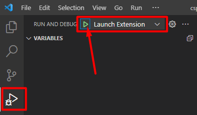

# Contributing

Contributions are very welcome.

Same steps works on Windows (powershell) and Linux. Just needs Node.js installed.

## How to create a new extension

Please fork this repository to add new dictionaries.

### Using Yeoman script

The [Yeoman](http://yeoman.io/) script can help you create the dictionary template files seen in most of dictionary directories.

### Setup Yeoman

Install Yeoman

```sh
npm install -g yo
```

Link the generator

```sh
npm run create:setup
```

#### Running the generator

In the `vscode-cspell-dict-extensions` repository root directory

```sh
npm run create:extension
```

OR

```sh
yo cspell-dict-extensions <language>
```

##### Example Answers for Swedish


Yeoman will ask you a series of questions most of which default suggestion is ok (to select default suggestion press enter without typing):

| Field                         | Description                                                                                                                                                                                                      |
| ----------------------------- | ---------------------------------------------------------------------------------------------------------------------------------------------------------------------------------------------------------------- |
| **name**                          | this is the dictionary. i.e. `swedish`, `ruby`, or `rust`                                                                                                                                                        |
| friendly name                 | this is the friendly name, like `Swedish`                                                                                                                                                                        |
| display name                  | this is the name shown on the VS Code Extensions page.                                                                                                                                                           |
| description                   | short description of the extension.                                                                                                                                                                              |
| **Source Dictionary**             | This is the NPM install name of the source eg. dictionary `@cspell/dict-sv` (@ is needed). Available dictionaries could be found here [https://github.com/streetsidesoftware/cspell-dicts#all-dictionaries](https://github.com/streetsidesoftware/cspell-dicts#all-dictionaries)                                                                                                                                                          |
| Add Enable / Disable Commands | This is used for adding helper commands for human language locals like `fr` for French or `fr,fr_CA` for Canadian French. This option is not necessary for word lists like `companies` or programming languages. |
| Base Name For Commands        | This is added as a suffix onto the command names.                                                                                                                                                                |
| Language Locale               | This is the two letter language code supported by the dictionary included in the `Source Dictionary` step.                                                                                                       |
| Target Directory              | Where to create the extension                                                                                                                                                                                    |
| NPM Package Name              | name added to the `package.json`                                                                                                                                                                                 |

After all the information is entered, the extension should be generated.

Please fix any errors and make sure the following two commands run:

```sh
cd extensions/<language>
npm install
npm run build
```

Please update files:
- `README.md`
  - Add yourself as contributor under `## Contributors` header

    ```txt
    _Language_ - [Username](https://github.com/Username)
    ```

- `extensions/<language>/samples/seattle.md`
  - Go to Seattle wikipedia page translated to your language and copy some content to `seattle.md`. It's later used to test if plugin recognizes words
  
Please update files if necessary (leave it as unless you know why you're changing it):

- `extensions/<language>/README.md`
- `extensions/<language>/package.json`
- `extensions/<language>/LICENSE`

There are other `.json` and `README` files where new extension is referenced but those are automatically generated after pull request so don't edit any other files.

## Licenses

Note: the preferred licenses are either MIT or GPL3.

The safest to use is GPL3, but it is the most sticky.

Since these extensions bundle the dictionary as part of the extension (falls under static linking clauses), the license must match the bundled dictionary / dictionaries.
If the bundled dictionary is GPL3, then the extension must be GPL3 or later.

## Testing Dictionary Extensions

### Open extension folder in VSCode

```sh
cd extensions/<language> # Might be already done in in previous step
code . # Opens vscode in current directory
```

### Run/Debug extension

Within VS Code `Debug -> Start Debugging` with the `Launch Extension` configuration.



This will open new VSCode window. Inside it open previously edited `seattle.md`. If most words of your language are now recognized (no blue squiggly line) you can open pull request to `main` branch. Build files are already in .gitignore so you can commit all changes.

Shortly after pull request is merged extension will appear in vscode extensions marketplace.
